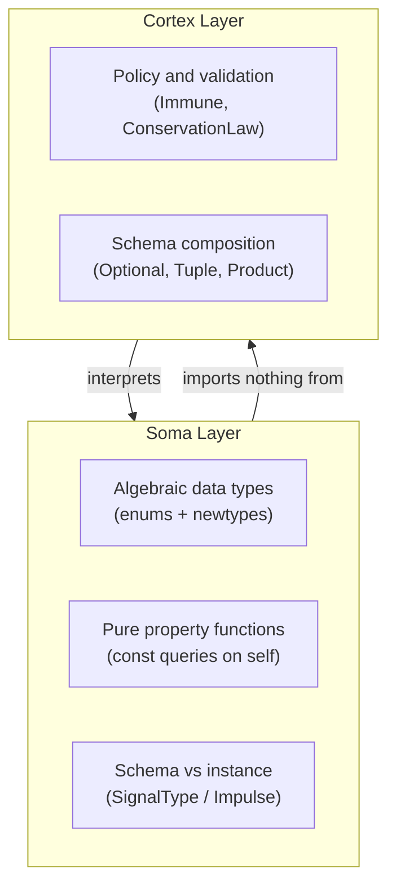

# bion-soma Implementation Plan

> **Layer**: Level 1 — Soma (Molecular Substrate)  
> **Crate**: `bion-soma`  
> **Biological metaphor**: Molecular Biology — *"What are things made of?"*  
> **Law**: A Soma type must be able to exist before any database, graph, runtime, or connection exists.  
> **Hard constraint**: No `use bion_*` imports anywhere in this crate. No `infinite-db` vocabulary. **Soma purity rule** — only immutable data and pure property functions (see below).

---

## Design Principles (FP & Type-Driven Design)

Soma is the molecular alphabet of Bion. Every type here must be expressible before any database, graph, runtime, or connection exists. The following principles govern all Soma types:



1. **Immutability first** — Public Soma types are `Copy` or cheap `Clone`; no interior mutability.
2. **Make illegal states unrepresentable** — Closed domains as enums; open domains as validated newtypes; sentinels eliminated at the type level where possible.
3. **Newtype by default** — Every domain concept gets its own type, even when backed by a primitive. Raw `u64` / `String` / `i64` must not appear in public Soma APIs except behind documented escape hatches.
4. **Schema vs instance** — `SignalType` is compile-time/schema knowledge; `Impulse` is runtime data. Every value variant maps 1:1 to a schema atom via `signal_type()`.
5. **Property vs policy** — Soma may expose **total, pure predicates** on its own data (e.g. `Polarity::opposite`). Soma must not encode registry lookups, graph context, or coercion policy.
6. **Explicit effects** — The only stateful Soma abstraction is `IdGen` (`&mut self`). Thread sharing is explicit at call sites (`Arc<Mutex<...>>`).
7. **Referential transparency for graph semantics** — All neuron types except `Memory` are *logically pure* at the Connectome layer; `NeuronType::is_stateful()` is the type-level flag.

### Soma purity rule

The header constraint "no behavior — only data" is refined here. Soma allows **pure property functions** on its own data; it forbids **policy, I/O, and side effects**.

| Allowed in Soma | Forbidden in Soma |
|-----------------|-------------------|
| `const fn` property queries on `self` | I/O, clocks, randomness (except inside `IdGen` impls) |
| `Display`, `From`, `TryFrom` for ergonomics | Validation against Cortex registries |
| Total functions on enums | Coercion that allocates or loses information silently |
| Pure invertible transforms (`opposite`) | References to graph / runtime / DB |

---

## Primitive Obsession Checklist

Use this table during implementation and code review for every public Soma type:

| Type | Wraps | Who mints | Validation | Escape hatch |
|------|-------|-----------|------------|--------------|
| `NeuronId` | `NonZeroU64` | `IdGen` only | always valid once minted | `as_raw()` behind `bridge` feature |
| `CortexTag` | `TagName` (inner) | `TryFrom` / `try_new` | non-empty, normalized | none (use `as_str()`) |
| `BoolValue` … `ByteBlob` | respective primitive | typed constructors | type-specific | `bridge` feature only |
| `Impulse` | tagged union of value newtypes | callers / upstream | must match `SignalType` | none |
| `SignalType` | enum (no inner primitive) | literals / derives | closed set | n/a |
| `Polarity`, `NeuronType` | enum | literals | closed set | n/a |
| `ValidSynapse` | `(Polarity, Polarity)` proof | `ValidSynapse::new` | Efferent → Afferent only | n/a |

---

## Crate Layout

```
bion-soma/
├── Cargo.toml
└── src/
    ├── lib.rs        ← re-exports only; no logic
    ├── id.rs         ← NeuronId, IdGen trait + default impls
    ├── neuron.rs     ← NeuronType, NeuronCapabilities
    ├── signal.rs     ← SignalType, value newtypes, Impulse, Compatibility
    ├── polarity.rs   ← Polarity, ValidSynapse
    └── tag.rs        ← CortexTag, TagName, TagError
```

No file split required yet; `signal.rs` grows but stays one module until it exceeds ~400 lines.

**Allowed dependencies** (Cargo.toml):
```toml
[dependencies]
uuid   = { version = "1", features = ["v4"] }  # for UuidIdGen impl
serde  = { version = "1", features = ["derive"], optional = true }

[features]
default = []
serde   = ["dep:serde"]
bridge  = []   # enables NeuronId::as_raw and value inner accessors for bion-bridge only
```

**`bridge` is not for application code.** Enable it only in `bion-bridge` (or equivalent serialization layer).

No other crate dependencies are permitted. If you find yourself adding one, stop and ask whether that dependency belongs at a higher level.

---

## File: `src/lib.rs`

**Purpose**: Clean re-export surface. Nothing lives here — no logic, no types, no trait impls.

```rust
//! bion-soma — the molecular alphabet.
//!
//! Level 1 of the Bion stack. All types here are ontologically prior:
//! they can exist before any database, graph, or runtime is instantiated.
//!
//! # Rule
//! This crate may not import from any other `bion-*` crate.
//! It may not reference any `infinite-db` type names.

#![deny(missing_docs)] // enforce on all public items once implementation lands

pub mod id;
pub mod neuron;
pub mod polarity;
pub mod signal;
pub mod tag;

// Flat re-exports — consumers use `bion_soma::NeuronId`, not `bion_soma::id::NeuronId`
pub use id::{IdGen, NeuronId, SequentialIdGen, UuidIdGen};
pub use neuron::{NeuronCapabilities, NeuronType};
pub use polarity::{Polarity, ValidSynapse};
pub use signal::{
    BoolValue, ByteBlob, Compatibility, CompatibilityReason, FloatValue, Impulse, IntValue,
    SignalText, SignalType, UnitValue,
};
pub use tag::{CortexTag, TagError};
```

**What to watch for**: If a future contributor adds `use bion_connectome::` here, the vocabulary wall has been breached. The CI lint should catch this, but a code review comment on `lib.rs` imports is a second line of defense.

---

## File: `src/id.rs`

**Purpose**: Identity primitives. A `NeuronId` is an opaque handle that says "this thing exists and is distinct from all other things." `IdGen` is the mechanism that mints them.

### `NeuronId`

```rust
use std::num::NonZeroU64;

/// An opaque, unique identifier for a Neuron.
///
/// `NeuronId` carries no semantic meaning beyond identity. It does not know
/// what kind of Neuron it identifies, what connections it has, or whether
/// the Neuron currently exists. It is a name tag, not a reference.
///
/// # Design note
/// The inner `NonZeroU64` is private. Nothing outside this module should
/// construct a `NeuronId` by raw value — only `IdGen` impls mint them.
/// This prevents accidentally valid-looking IDs from being fabricated and
/// makes zero an unrepresentable ID (use `Option<NeuronId>` for absence).
#[derive(Debug, Clone, Copy, PartialEq, Eq, Hash, PartialOrd, Ord)]
#[cfg_attr(feature = "serde", derive(serde::Serialize, serde::Deserialize))]
pub struct NeuronId(NonZeroU64);

impl NeuronId {
    /// Private constructor — only callable within this module.
    /// External code must go through an `IdGen` impl.
    pub(crate) fn from_nonzero(raw: NonZeroU64) -> Self {
        Self(raw)
    }

    /// Expose the raw value for serialization / bridge mapping only.
    ///
    /// # Bridge only
    /// Enabled with the `bridge` feature. Do not use this to construct IDs —
    /// use `IdGen`. Application code must not depend on raw ID values.
    #[cfg(feature = "bridge")]
    pub fn as_raw(&self) -> u64 {
        self.0.get()
    }
}

impl std::fmt::Display for NeuronId {
    fn fmt(&self, f: &mut std::fmt::Formatter<'_>) -> std::fmt::Result {
        write!(f, "NeuronId({})", self.0)
    }
}
```

**Why `NonZeroU64` and not raw `u64`?** Eliminates the magic sentinel `0` for "no ID." Absence is expressed as `Option<NeuronId>` at the bridge and Connectome layers. The inner value is still a cheap `u64` for map keys and comparison.

**Why `u64` and not `Uuid`?** Two reasons: (1) `u64` comparison is trivially cheap and is the right type for in-memory graph node indexing. (2) The bridge layer is responsible for mapping between Bion IDs and whatever the database uses internally — that mapping lives in `bion-bridge`, not here. If the database uses UUIDs, the bridge maps; Soma stays simple.

**Why private inner field?** If `NeuronId` is constructable from outside the crate, nothing prevents fabrication of IDs that point to nonexistent neurons. Making construction go through `IdGen` is an invariant: every `NeuronId` in the system was issued by something that knows what it's doing.

---

### `IdGen` — Trait

```rust
/// Identity generation service.
///
/// `IdGen` is a trait so that different contexts can use different strategies:
/// - Production: UUID-based (globally unique, safe across distributed nodes)
/// - Testing: Sequential (deterministic, debuggable, reproducible)
/// - Simulation: Seeded random (reproducible chaos)
///
/// Implementors must guarantee that no two calls to `next_id` on the same
/// instance return the same `NeuronId` within the instance's lifetime.
pub trait IdGen: Send + Sync {
    fn next_id(&mut self) -> NeuronId;
}
```

**Why `&mut self`?** Because generating an ID is a stateful operation — a counter increments, a UUID RNG advances, etc. Taking `&mut self` makes that statefulness explicit at the type level and prevents accidental shared-state bugs in concurrent contexts. If you want thread-safe shared generation, wrap in `Arc<Mutex<dyn IdGen>>` at the call site.

**Why `Send + Sync`?** IdGen impls will be passed into the executor and preview runtime, both of which may spawn threads. Bounding the trait here prevents a footgun where a `!Send` impl compiles in single-threaded tests but panics in production.

**IdGen laws** (test invariants):
- **Distinctness**: no two calls to `next_id` on the same instance return the same `NeuronId`.
- **Monotonicity** (`SequentialIdGen` only): each ID is strictly greater than the previous when compared via `as_raw()` under the `bridge` feature.

---

### `SequentialIdGen` — Test impl

```rust
/// A deterministic, sequential `IdGen` for use in tests and simulations.
///
/// IDs start at 1 because `NeuronId` wraps `NonZeroU64` — zero is
/// unrepresentable. Use `Option<NeuronId>` for absence at higher layers.
///
/// # Warning
/// Do not use in production. Sequential IDs are predictable and
/// will collide if two instances are created independently.
pub struct SequentialIdGen {
    counter: NonZeroU64,
}

impl SequentialIdGen {
    pub fn new() -> Self {
        Self {
            counter: NonZeroU64::MIN,
        }
    }
}

impl Default for SequentialIdGen {
    fn default() -> Self {
        Self::new()
    }
}

impl IdGen for SequentialIdGen {
    fn next_id(&mut self) -> NeuronId {
        let id = NeuronId::from_nonzero(self.counter);
        self.counter = self.counter.checked_add(1).expect("SequentialIdGen exhausted");
        id
    }
}
```

---

### `UuidIdGen` — Production impl

```rust
/// A UUID-based `IdGen` for production use.
///
/// Each call generates a new UUIDv4, truncates to u64 via the high 64 bits.
/// If the high bits are zero (astronomically rare), retries until non-zero.
/// Collision probability is astronomically low for any realistic graph size.
///
/// # Design note
/// We truncate UUID to u64 rather than storing the full 128-bit UUID because
/// `NeuronId` is used as a map key throughout the hot execution path and
/// u64 hashing is significantly faster than u128. The bridge layer stores
/// the full UUID mapping if needed for external correlation.
pub struct UuidIdGen;

impl IdGen for UuidIdGen {
    fn next_id(&mut self) -> NeuronId {
        loop {
            let uuid = uuid::Uuid::new_v4();
            let (high, _) = uuid.as_u64_pair();
            if let Some(nz) = NonZeroU64::new(high) {
                return NeuronId::from_nonzero(nz);
            }
            // Retry on zero — expected once per 2^64 generations
        }
    }
}
```

**The truncation tradeoff**: The birthday problem at u64 scale means collision probability reaches ~50% only around 4 billion IDs — far beyond any realistic Bion graph. This is an acceptable engineering tradeoff for the performance gain on the hot path.

---

## File: `src/neuron.rs`

**Purpose**: Declares the functional *roles* a Neuron can play. This is a topology hint — it tells the editor, the validator, and the wiring layer what kind of position a Neuron can occupy in the graph.

```rust
/// The functional role of a Neuron within the biological graph.
///
/// `NeuronType` is not a runtime behavior tag — it does not change how
/// signals are computed. It is a *structural role* that governs:
/// - Where in the graph a Neuron may legally appear
/// - Which Fiber polarities are valid for this role
/// - How the Genesis editor renders this node on the canvas
///
/// Think of it as the cell type in biology: a neuron's type determines
/// its morphology and position in the nervous system, not the chemistry
/// of any individual signal it fires.
#[derive(Debug, Clone, Copy, PartialEq, Eq, Hash)]
#[cfg_attr(feature = "serde", derive(serde::Serialize, serde::Deserialize))]
pub enum NeuronType {
    /// Receives input from outside the system (world → graph boundary).
    /// Maps to a Membrane Receptor upstream. Must have at least one
    /// Efferent Fiber and zero Afferent Fibers on its external surface.
    Sensory,

    /// Produces effects outside the system (graph → world boundary).
    /// Maps to a Membrane Effector upstream. Must have at least one
    /// Afferent Fiber and zero Efferent Fibers on its external surface.
    Motor,

    /// Internal processing node. No direct connection to the world surface.
    /// May have any number of Afferent and Efferent Fibers.
    /// This is the most common NeuronType in a typical app graph.
    Interneuron,

    /// Stateful node. Holds a value across signal wavefronts.
    /// Unlike other types, a Memory neuron's output is its stored state,
    /// not a pure function of its current inputs.
    /// Corresponds to: a variable, a counter, a cache, a latch.
    Memory,

    /// Clock node. Fires on a schedule independent of input signals.
    /// Corresponds to: a timer, a polling interval, an animation frame tick.
    /// Pacemakers are the only Neurons that can initiate a wavefront
    /// without receiving an external Impulse.
    Pacemaker,
}

impl NeuronType {
    /// Returns true if this NeuronType may appear at the graph boundary
    /// (connected to Membrane Receptors or Effectors).
    pub const fn is_boundary(self) -> bool {
        matches!(self, NeuronType::Sensory | NeuronType::Motor)
    }

    /// Returns true if this NeuronType can initiate a wavefront
    /// without receiving an external Impulse.
    pub const fn is_autonomous(self) -> bool {
        matches!(self, NeuronType::Pacemaker)
    }

    /// Returns true if this NeuronType carries state across wavefronts.
    pub const fn is_stateful(self) -> bool {
        matches!(self, NeuronType::Memory)
    }

    /// Structural capability flags for this role.
    ///
    /// Prefer this when Cortex or Genesis need multiple flags at once —
    /// avoids boolean proliferation at call sites.
    pub const fn capabilities(self) -> NeuronCapabilities {
        NeuronCapabilities {
            boundary: self.is_boundary(),
            autonomous: self.is_autonomous(),
            stateful: self.is_stateful(),
        }
    }
}

/// Structural capability flags derived from a `NeuronType`.
#[derive(Debug, Clone, Copy, PartialEq, Eq, Hash)]
#[cfg_attr(feature = "serde", derive(serde::Serialize, serde::Deserialize))]
pub struct NeuronCapabilities {
    /// May appear at the graph boundary (Sensory / Motor).
    pub boundary: bool,
    /// Can initiate a wavefront without external input (Pacemaker).
    pub autonomous: bool,
    /// Carries state across wavefronts (Memory).
    pub stateful: bool,
}
```

**Why helper methods on a Soma type?** These methods encode structural *facts* about the type that are inherent to its definition — they don't depend on any other layer. The Cortex `Immune` validator and the Genesis canvas both need to ask these questions. Putting the logic here means it can't drift between callers. These are pure property functions, not behaviors.

**Exhaustiveness**: Adding a new `NeuronType` variant requires updating `is_boundary`, `is_autonomous`, `is_stateful`, and `capabilities`. Write each `match` without wildcards so the compiler enforces this.

**The `Memory` NeuronType is the most dangerous to misuse.** A Memory neuron breaks the pure functional model of the graph — its output is not solely a function of its inputs, but of accumulated history. This is necessary for real apps (state must live somewhere), but the Cortex layer's `ConservationLaw` system exists partly to constrain what Memory neurons can do. The tag here is the first signal: "this node is stateful; treat it accordingly."

---

## File: `src/signal.rs`

**Purpose**: Defines the type system of the graph (`SignalType`), the typed value atoms that flow through it (value newtypes), and the tagged union of those values (`Impulse`). These types are logically paired: `SignalType` is the schema, value newtypes are typed payloads, `Impulse` is the instance.

### Value newtypes

Each `Impulse` payload is a newtype — never a bare primitive in the public API.

| Newtype | Inner | Notes |
|---------|-------|-------|
| `BoolValue` | `bool` | `const fn new(v: bool)` |
| `IntValue` | `i64` | no implicit float conversion |
| `FloatValue` | `f64` | custom `PartialEq` (NaN policy documented below) |
| `SignalText` | `String` | UTF-8 text, not arbitrary bytes |
| `ByteBlob` | `Vec<u8>` | raw bytes; name avoids clash with `SignalType::Bytes` |
| `UnitValue` | zero-sized | explicit trigger token |

```rust
/// A boolean signal value.
#[derive(Debug, Clone, Copy, PartialEq, Eq, Hash)]
#[cfg_attr(feature = "serde", derive(serde::Serialize, serde::Deserialize))]
pub struct BoolValue(bool);

impl BoolValue {
    pub const fn new(value: bool) -> Self {
        Self(value)
    }

    #[cfg(feature = "bridge")]
    pub const fn as_bool(self) -> bool {
        self.0
    }
}

/// A 64-bit signed integer signal value.
#[derive(Debug, Clone, Copy, PartialEq, Eq, Hash)]
#[cfg_attr(feature = "serde", derive(serde::Serialize, serde::Deserialize))]
pub struct IntValue(i64);

impl IntValue {
    pub const fn new(value: i64) -> Self {
        Self(value)
    }

    #[cfg(feature = "bridge")]
    pub const fn as_i64(self) -> i64 {
        self.0
    }
}

/// A 64-bit IEEE 754 floating-point signal value.
///
/// Does not implement `Eq` — use `PartialEq` only. Equality uses
/// `f64::to_bits()` so NaN == NaN (deterministic value comparison).
#[derive(Debug, Clone, Copy)]
#[cfg_attr(feature = "serde", derive(serde::Serialize, serde::Deserialize))]
pub struct FloatValue(f64);

impl FloatValue {
    pub const fn new(value: f64) -> Self {
        Self(value)
    }

    #[cfg(feature = "bridge")]
    pub const fn as_f64(self) -> f64 {
        self.0
    }
}

impl PartialEq for FloatValue {
    fn eq(&self, other: &Self) -> bool {
        self.0.to_bits() == other.0.to_bits()
    }
}

/// A UTF-8 text signal value.
#[derive(Debug, Clone, PartialEq, Eq, Hash)]
#[cfg_attr(feature = "serde", derive(serde::Serialize, serde::Deserialize))]
pub struct SignalText(String);

impl SignalText {
    pub fn new(value: impl Into<String>) -> Self {
        Self(value.into())
    }

    pub fn as_str(&self) -> &str {
        &self.0
    }

    #[cfg(feature = "bridge")]
    pub fn into_inner(self) -> String {
        self.0
    }
}

/// Raw binary signal data. No encoding assumed.
#[derive(Debug, Clone, PartialEq, Eq, Hash)]
#[cfg_attr(feature = "serde", derive(serde::Serialize, serde::Deserialize))]
pub struct ByteBlob(Vec<u8>);

impl ByteBlob {
    pub fn new(value: impl Into<Vec<u8>>) -> Self {
        Self(value.into())
    }

    pub fn len(&self) -> usize {
        self.0.len()
    }

    pub fn is_empty(&self) -> bool {
        self.0.is_empty()
    }

    #[cfg(feature = "bridge")]
    pub fn into_inner(self) -> Vec<u8> {
        self.0
    }
}

/// Explicit trigger token — the signal is the fact of firing, not data.
#[derive(Debug, Clone, Copy, PartialEq, Eq, Hash, Default)]
#[cfg_attr(feature = "serde", derive(serde::Serialize, serde::Deserialize))]
pub struct UnitValue;

impl UnitValue {
    pub const fn new() -> Self {
        Self
    }
}
```

**Construction rule**: Always `Impulse::Bool(BoolValue::new(x))` — never `Impulse::Bool(x)`. Constructing from bare primitives without newtypes is a bridge/Cortex concern, not a public Soma API.

---

### `SignalType`

```rust
/// The type of data that a Fiber carries and a Synapse transmits.
///
/// `SignalType` is the type system of the Bion graph. Two Fibers may only
/// form a valid Synapse if their SignalTypes are compatible. Compatibility
/// checking lives in `bion-cortex` (the `Immune` validator) — this enum
/// only defines what types exist.
///
/// # Design constraint
/// Keep this flat and minimal. The temptation is to make this a recursive
/// algebraic type (Optional<SignalType>, Tuple<Vec<SignalType>>, etc.).
/// Resist it: schema composition belongs in `bion-cortex`, not here.
/// Soma defines atoms; Cortex defines molecules of those atoms.
#[derive(Debug, Clone, Copy, PartialEq, Eq, Hash)]
#[cfg_attr(feature = "serde", derive(serde::Serialize, serde::Deserialize))]
pub enum SignalType {
    /// A boolean signal: true or false, on or off, fired or silent.
    Bool,

    /// A 64-bit signed integer.
    Int,

    /// A 64-bit IEEE 754 floating-point number.
    /// Marker variant only — no f64 payload. All float impulses share this schema key.
    Float,

    /// A UTF-8 string of arbitrary length.
    Text,

    /// Raw binary data. No encoding assumed.
    Bytes,

    /// The absence of a value. Used for event-only signals (triggers)
    /// that carry no payload — the signal is the fact of firing, not data.
    Unit,
}
```

**`SignalType::Float` equality**: This is a marker variant with no inner `f64`, so derived `Eq + Hash` is correct. NaN semantics apply to `FloatValue` at the instance level, not to the schema key.

---

### `Compatibility`

Replace bare `bool` compatibility checks with an explicit ADT. Callers that only need a predicate can use the convenience method.

```rust
/// Why two signal types are or are not compatible.
#[derive(Debug, Clone, Copy, PartialEq, Eq, Hash)]
#[cfg_attr(feature = "serde", derive(serde::Serialize, serde::Deserialize))]
pub enum CompatibilityReason {
    TypeMismatch,
    LossyConversion,
}

/// Result of comparing two signal types for lossless compatibility.
#[derive(Debug, Clone, Copy, PartialEq, Eq, Hash)]
#[cfg_attr(feature = "serde", derive(serde::Serialize, serde::Deserialize))]
pub enum Compatibility {
    /// Same type — exact match.
    Exact,
    /// Lossless widening (e.g. Int → Float).
    Widening { from: SignalType, to: SignalType },
    /// Incompatible — coercion would lose information or change meaning.
    Incompatible {
        from: SignalType,
        to: SignalType,
        reason: CompatibilityReason,
    },
}

impl SignalType {
    /// Returns the compatibility relationship between `self` and `target`.
    ///
    /// This is intentionally conservative: only lossless promotions.
    /// `Int` → `Float` is allowed (widening). `Float` → `Int` is not
    /// (truncation). `Text` → `Bytes` is not (encoding ambiguity).
    ///
    /// Coercion policy beyond this lives in `bion-cortex`.
    pub fn compatibility_with(self, target: SignalType) -> Compatibility {
        if self == target {
            return Compatibility::Exact;
        }
        match (self, target) {
            (SignalType::Int, SignalType::Float) => Compatibility::Widening {
                from: SignalType::Int,
                to: SignalType::Float,
            },
            _ => Compatibility::Incompatible {
                from: self,
                to: target,
                reason: CompatibilityReason::TypeMismatch,
            },
        }
    }

    /// Convenience predicate — true when `compatibility_with` is not `Incompatible`.
    pub fn is_compatible_with(self, target: SignalType) -> bool {
        !matches!(
            self.compatibility_with(target),
            Compatibility::Incompatible { .. }
        )
    }
}
```

**Why not `Optional<SignalType>`?** Because optionality is a *behavioral policy* — when is it acceptable for a signal to be absent? That's a Cortex concern (`ConservationLaw`). Soma only knows what primitive types exist. Composing them is a higher-level concern.

**Why `Unit`?** Many reactive patterns fire a signal purely as a trigger — "the button was clicked" carries no data, only the fact of occurrence. Without `Unit`, you'd be forced to use `Bool(true)` as a sentinel, which is semantically incorrect and confusing. `Unit` makes the intent explicit.

---

### `Impulse`

```rust
/// A typed data quantum — the payload carried by a Synapse.
///
/// `Impulse` is the *value* that corresponds to a `SignalType` *schema*.
/// Every variant wraps a value newtype that corresponds to exactly one `SignalType`.
///
/// # What Impulse is NOT
/// - Not a message envelope (no sender, timestamp, or routing metadata)
/// - Not an event (events are `MembraneEvent` in `bion-membrane`)
/// - Not an `ActionPotential` (which is `Impulse` + propagation context,
///   defined in `bion-connectome`)
///
/// An `Impulse` is raw data. The packet that wraps it lives in the
/// Connectome layer.
#[derive(Debug, Clone, PartialEq)]
#[cfg_attr(feature = "serde", derive(serde::Serialize, serde::Deserialize))]
pub enum Impulse {
    Bool(BoolValue),
    Int(IntValue),
    Float(FloatValue),
    Text(SignalText),
    Bytes(ByteBlob),
    Unit(UnitValue),
}

impl Impulse {
    /// Returns the `SignalType` of this `Impulse`.
    ///
    /// This is the canonical relationship between instance and schema.
    /// An `Impulse` always knows its own type.
    pub const fn signal_type(&self) -> SignalType {
        match self {
            Impulse::Bool(_) => SignalType::Bool,
            Impulse::Int(_) => SignalType::Int,
            Impulse::Float(_) => SignalType::Float,
            Impulse::Text(_) => SignalType::Text,
            Impulse::Bytes(_) => SignalType::Bytes,
            Impulse::Unit(_) => SignalType::Unit,
        }
    }

    /// Returns the compatibility relationship with the given target schema.
    pub fn compatibility_with(&self, target: SignalType) -> Compatibility {
        self.signal_type().compatibility_with(target)
    }

    /// Convenience predicate — true when `compatibility_with` is not `Incompatible`.
    pub fn is_compatible_with(&self, target: SignalType) -> bool {
        self.signal_type().is_compatible_with(target)
    }
}

impl std::fmt::Display for Impulse {
    fn fmt(&self, f: &mut std::fmt::Formatter<'_>) -> std::fmt::Result {
        match self {
            Impulse::Bool(v) => write!(f, "Bool({v})"),
            Impulse::Int(v) => write!(f, "Int({v})"),
            Impulse::Float(v) => write!(f, "Float({v})"),
            Impulse::Text(v) => write!(f, "Text({v:?})", v.as_str()),
            Impulse::Bytes(v) => write!(f, "Bytes([{} bytes])", v.len()),
            Impulse::Unit(_) => write!(f, "Unit"),
        }
    }
}
```

Implement `Display` on each value newtype (`BoolValue`, `IntValue`, etc.) so formatting does not require the `bridge` feature.

**Note on `FloatValue` and `PartialEq`**: `FloatValue` uses bit-pattern equality (`to_bits()`), which treats NaN == NaN. This is intentional for deterministic value comparison. `SignalType::Float` is a marker without payload — schema keys use derived `Eq + Hash`; value comparison uses `FloatValue`'s own semantics. These are different use cases and are handled differently on purpose.

---

## File: `src/polarity.rs`

**Purpose**: Directedness. Every Fiber in the system faces exactly one direction. `Polarity` is the type that encodes that direction.

```rust
/// The directional orientation of a Fiber connection point.
///
/// Every Fiber has a Polarity. A Synapse must connect an `Efferent` Fiber
/// on the emitting side to an `Afferent` Fiber on the receiving side.
/// Connecting two Fibers of the same Polarity is a wiring error —
/// detected by `bion-cortex`'s `Immune` validator.
///
/// # Biological basis
/// - Afferent: toward the center (sensory — bringing information in)
/// - Efferent: away from the center (motor — sending output out)
///
/// In Bion, "center" means the Ganglion that owns the Fiber.
/// An Afferent Fiber receives signals from outside the Ganglion.
/// An Efferent Fiber sends signals out of the Ganglion.
#[derive(Debug, Clone, Copy, PartialEq, Eq, Hash)]
#[cfg_attr(feature = "serde", derive(serde::Serialize, serde::Deserialize))]
pub enum Polarity {
    /// Receives — carries signals into the owning Ganglion.
    Afferent,

    /// Emits — carries signals out of the owning Ganglion.
    Efferent,
}

impl Polarity {
    /// Returns the opposite polarity.
    ///
    /// A valid Synapse always connects opposite polarities.
    /// Use this to validate or auto-complete wiring.
    ///
    /// # Law
    /// `p.opposite().opposite() == p` (involution).
    pub const fn opposite(self) -> Polarity {
        match self {
            Polarity::Afferent => Polarity::Efferent,
            Polarity::Efferent => Polarity::Afferent,
        }
    }

    /// Returns true if this polarity is compatible as a Synapse target
    /// for a Fiber with the given `source` polarity.
    ///
    /// Valid: Efferent → Afferent
    /// Invalid: Afferent → Afferent, Efferent → Efferent, Afferent → Efferent
    pub const fn can_connect_to(self, target: Polarity) -> bool {
        matches!(
            (self, target),
            (Polarity::Efferent, Polarity::Afferent)
        )
    }
}

/// A validated Efferent → Afferent connection.
///
/// Construct only via `ValidSynapse::new` — makes a legal wiring orientation
/// unforgeable without passing the structural check (parse, don't validate).
#[derive(Debug, Clone, Copy, PartialEq, Eq, Hash)]
#[cfg_attr(feature = "serde", derive(serde::Serialize, serde::Deserialize))]
pub struct ValidSynapse {
    /// Emitting side — must be Efferent.
    pub source: Polarity,
    /// Receiving side — must be Afferent.
    pub sink: Polarity,
}

impl ValidSynapse {
    /// Returns `Some` only when `source.can_connect_to(sink)`.
    pub fn new(source: Polarity, sink: Polarity) -> Option<Self> {
        if source.can_connect_to(sink) {
            Some(Self { source, sink })
        } else {
            None
        }
    }
}

impl std::fmt::Display for Polarity {
    fn fmt(&self, f: &mut std::fmt::Formatter<'_>) -> std::fmt::Result {
        match self {
            Polarity::Afferent => write!(f, "Afferent (←)"),
            Polarity::Efferent => write!(f, "Efferent (→)"),
        }
    }
}
```

**Why `can_connect_to` here and not in Cortex?** Because this is a *structural fact* about what Polarity means — it's not a policy decision. The rule "Efferent connects to Afferent" is as invariant as "a USB-A plug connects to a USB-A socket." It's definitional, not behavioral. The Cortex `Immune` validator *calls* this method but doesn't *define* the rule. This is the distinction between a property and a policy.

**Why `ValidSynapse`?** A bare `(Polarity, Polarity)` tuple is primitive obsession — any pair can be constructed without validation. `ValidSynapse` is the proof type that a connection orientation passed the structural check.

---

## File: `src/tag.rs`

**Purpose**: Routing and filtering metadata. `CortexTag` is a label that associates a Neuron or Fiber with a named behavioral domain. The tag itself is inert — it's the Cortex layer that interprets what the tag means and what rules apply to nodes bearing it.

```rust
/// Errors that can occur when constructing a `CortexTag`.
#[derive(Debug, Clone, Copy, PartialEq, Eq, Hash)]
pub enum TagError {
    Empty,
    InvalidCharacter(char),
    TooLong { max: usize },
}

/// Normalized, non-empty tag name (private inner newtype).
#[derive(Debug, Clone, PartialEq, Eq, Hash, PartialOrd, Ord)]
struct TagName(String);

impl TagName {
    fn try_from_str(name: &str) -> Result<Self, TagError> {
        const MAX_LEN: usize = 256;
        let trimmed = name.trim();
        if trimmed.is_empty() {
            return Err(TagError::Empty);
        }
        if trimmed.len() > MAX_LEN {
            return Err(TagError::TooLong { max: MAX_LEN });
        }
        for ch in trimmed.chars() {
            if !(ch.is_alphanumeric() || ch == '-' || ch == '_') {
                return Err(TagError::InvalidCharacter(ch));
            }
        }
        Ok(Self(trimmed.to_owned()))
    }
}

/// A routing and filtering label associating a node with a behavioral domain.
///
/// `CortexTag` is inert data — it carries no behavior of its own.
/// The Cortex layer reads these tags to know which `Behavior` and
/// `ConservationLaw` rules apply to a given Neuron or Fiber.
///
/// # Analogy
/// Think of a CortexTag like a postal district code. The code itself is
/// just a label. The routing logic that decides what happens to mail
/// with that code lives in the post office (Cortex), not on the envelope.
///
/// # Design note
/// `CortexTag` wraps a validated `TagName` rather than a bare `String`.
/// The set of *known* tags is not fixed at Soma compile time — app authors
/// and framework authors define tags dynamically. Validation of whether
/// a tag names a registered domain lives in `bion-cortex`.
#[derive(Debug, Clone, PartialEq, Eq, Hash, PartialOrd, Ord)]
#[cfg_attr(feature = "serde", derive(serde::Serialize, serde::Deserialize))]
pub struct CortexTag(TagName);

impl CortexTag {
    /// Creates a new `CortexTag` after validating and normalizing the name.
    pub fn try_new(name: &str) -> Result<Self, TagError> {
        Ok(Self(TagName::try_from_str(name)?))
    }

    /// Returns the tag name as a string slice.
    pub fn as_str(&self) -> &str {
        &self.0.0
    }
}

impl std::fmt::Display for CortexTag {
    fn fmt(&self, f: &mut std::fmt::Formatter<'_>) -> std::fmt::Result {
        write!(f, "#{}", self.as_str())
    }
}

impl TryFrom<&str> for CortexTag {
    type Error = TagError;

    fn try_from(value: &str) -> Result<Self, Self::Error> {
        Self::try_new(value)
    }
}
```

**Why not an enum?** Because Soma can't know what tags exist — that's determined by app authors and framework authors at configuration time, not at Bion compile time. An enum would require Soma to import from Cortex (backwards dependency violation) or would need to be extensible (trait objects, which add complexity). A validated newtype defers the closed-world assumption to the layer that actually has it: Cortex.

**Why no infallible `From<&str>`?** Empty and malformed tag strings are illegal states. `TryFrom` makes invalid construction explicit at the type level rather than deferring failure to Cortex.

**Why `CortexTag` in Soma at all?** It might seem odd that a "Cortex" concept lives in Soma. The answer is that the *type* of the tag — the fact that tags exist and are string-labeled — is a Soma-level structural fact. The *meaning* of any particular tag, and what rules it triggers, is a Cortex concern. The tag is just a label; the post office is Cortex.

---

## Tests

Each module should have inline unit tests covering core behavior and algebraic laws:

| Module | What to test |
|--------|-------------|
| `id.rs` | `SequentialIdGen` produces distinct, monotonic IDs; `UuidIdGen` produces distinct IDs; `NeuronId` cannot be constructed from raw value outside the module; no generated ID is zero; `as_raw` roundtrip only with `bridge` feature |
| `neuron.rs` | `is_boundary()` returns true for Sensory/Motor only; `is_autonomous()` for Pacemaker only; `is_stateful()` for Memory only; `capabilities()` consistent with individual predicates |
| `signal.rs` | Each `Impulse` variant's `signal_type()`; `compatibility_with()` returns `Exact`, `Widening` (Int→Float), and `Incompatible` (Float→Int); `is_compatible_with()` matches; value newtypes construct via typed `new()` only |
| `polarity.rs` | `opposite()` involution (`p.opposite().opposite() == p`); `can_connect_to()` passes Efferent→Afferent only; `ValidSynapse::new` ↔ `can_connect_to` equivalence |
| `tag.rs` | `Display` formats as `#name`; `try_new` / `TryFrom` roundtrip for valid tags; `""` → `TagError::Empty`; invalid characters → `TagError::InvalidCharacter` |

**Future CI enhancement**: compile-fail tests via `trybuild` to ensure bare `i64` / `String` / `bool` cannot be passed to `Impulse` variants without value newtypes.

---

## Invariants for CI Lint

The vocabulary lint must verify that no file under `bion-soma/src/` contains any of the following `infinite-db` terms:

```
Node, Edge, Record, Table, Row, Column, Schema, Query, Index,
Transaction, Commit, Store, Fetch, Cursor, Collection
```

And must verify that no file under `bion-soma/src/` contains any `use bion_` import.

These two checks together enforce the layer boundary at the source level.

---

## What Comes Next (P2: bion-store)

Once `bion-soma` is stable, `bion-store` builds on top of it. The store layer will define:

- `NeuronStore` trait — fetch/persist Neurons by `NeuronId`
- `GanglionStore` trait — fetch/persist `GanglionGenome` by `GanglionId` (defined in `bion-connectome`)
- `SynapseStore` trait — fetch/persist Synapse definitions

`bion-store` may import from `bion-soma` (Level 1 → infrastructure is permitted). The reverse is never permitted.
